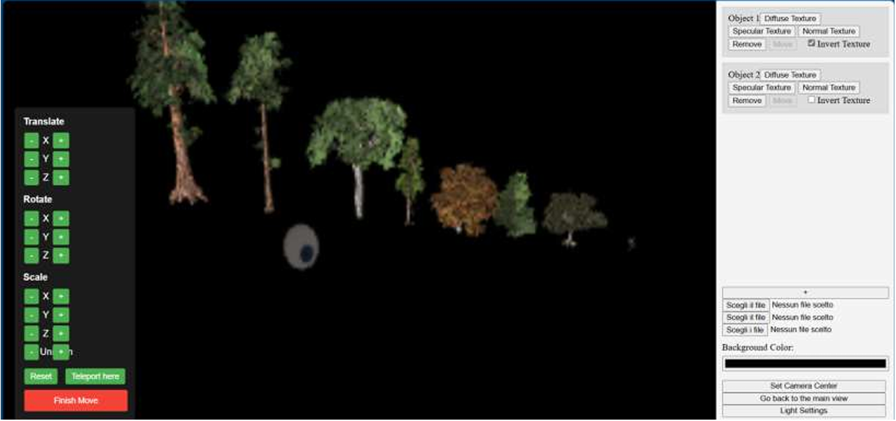

# Graphics Engine 🇮🇹 / 🇬🇧

## 🇮🇹 Italiano

**Disclaimer**: applicazione fatta per l'esame di _Interactive Graphics_, nel primo anno della facoltà triennale di _AI & Robotics_ di _Sapienza Università di Roma_.  
_Graphics Engine_ è un motore grafico sviluppato in WebGL, offrendo un framework agli utenti per rendering 3D e una base per un motore fisico.
Una lista non esaustiva di funzioni implementate sono:
* **Supporto dei file .obj/.mtl**: è possibile leggere i file in formato .obj/.mtl per poterli renderizzare sullo schermo.
* **Trasformazioni affini**: è possibile effettuare trasformazioni affini agli oggetti importati ( posizione, rotazione, skew ).
* **Rendering in tempo reale**: è possibile renderizzare in tempo reale l'ambiente creato con i modelli 3D.
* **Rendering realistico**: grazie ad una serie di tecniche di rendering utilizzate ( Blinn-Phong + ambient + emission reflection 
mode, adapting bi-linear/tri-linear filtering, Smooth normals interpolation e tanto altro )

E' stato inoltre creato un simulatore di rendering per mostrare le capacità del framework.

  

### 🛠 Tecnologie usate
- Javascript: codice di base.
- WebGL: per le API di rendering per la GPU.
---

## 🇬🇧 English

**Disclaimer**: This application was developed for the _Interactive Graphics_ exam during the first year of the Bachelor's degree in _AI & Robotics_ at _Sapienza University of Rome_.  
_Graphics Engine_ is a graphics engine developed in WebGL, providing users with a framework for 3D rendering and a foundation for a physics engine.  
A non-exhaustive list of implemented features includes:
* **Support for .obj/.mtl files**: The engine can load and render 3D models from .obj and .mtl files.
* **Affine transformations**: Users can apply affine transformations to imported objects (position, rotation, skew).
* **Real-time rendering**: The environment with 3D models can be rendered in real time.
* **Realistic rendering**: Several rendering techniques are implemented (Blinn-Phong + ambient + emission reflection mode, adapting bi-linear/tri-linear filtering, smooth normals interpolation, and more).

A rendering simulator has also been developed to showcase the capabilities of the framework.

  

### 🛠 Technologies Used
- JavaScript: core codebase.
- WebGL: for GPU rendering APIs.
---
